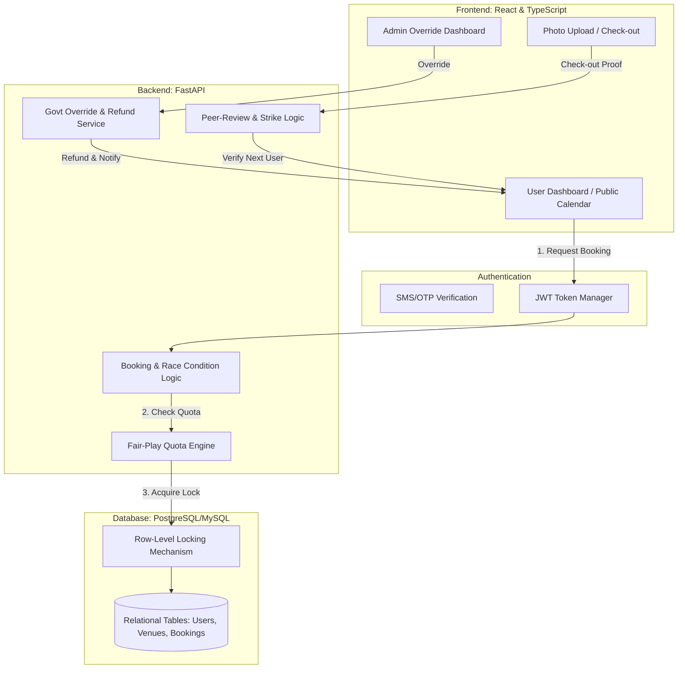

# Project Presentation Summary: Venue Scheduler

## 1. The Core Vision
A digital "Public Ledger" for town venues that replaces opaque manual booking with absolute transparency. It ensures that public resources—like cricket grounds and community halls—are accessible to everyone fairly, not just those with connections.

## 2. Key Technical Problems & Solutions
*   **Problem:** Backdoor Favoritism.
    *   **Solution:** **Public Calendar Transparency.** Every booking is visible to all citizens; if the Govt overrides a slot, they must provide a public reason (e.g., "Emergency Maintenance").
*   **Problem:** Double Bookings / Race Conditions.
    *   **Solution:** **Database Row-Level Locking.** Prevents two users from booking the same millisecond slot by forcing sequential processing at the database layer.
*   **Problem:** Messy Venues.
    *   **Solution:** **Peer-Review Loop.** The next user reports the previous user's cleanliness. Failure results in forfeited deposits and "Fair-Play Strikes."

## 3. The End Result (End-User Experience)
*   **Citizens:** Instant mobile booking, automated waitlists, and digital check-outs with photo proof.
*   **Admins:** Automated rule enforcement (Quotas/Strikes) and a high-level override dashboard for municipal needs.
*   **Society:** Higher utilization of public spaces, zero scheduling disputes, and reduced corruption in resource allocation.

## 4. Technology Stack
*   **Frontend:** React (TS) + Tailwind + FullCalendar.js.
*   **Backend:** FastAPI (Python) - High performance & Asynchronous.
*   **Database:** PostgreSQL/MySQL - ACID compliant for financial/booking integrity.

---

## 5. System Logic Flow (Mermaid)
