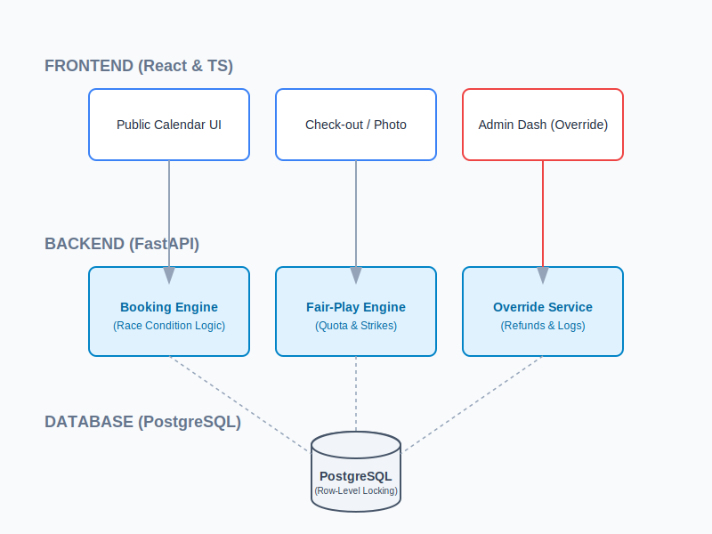
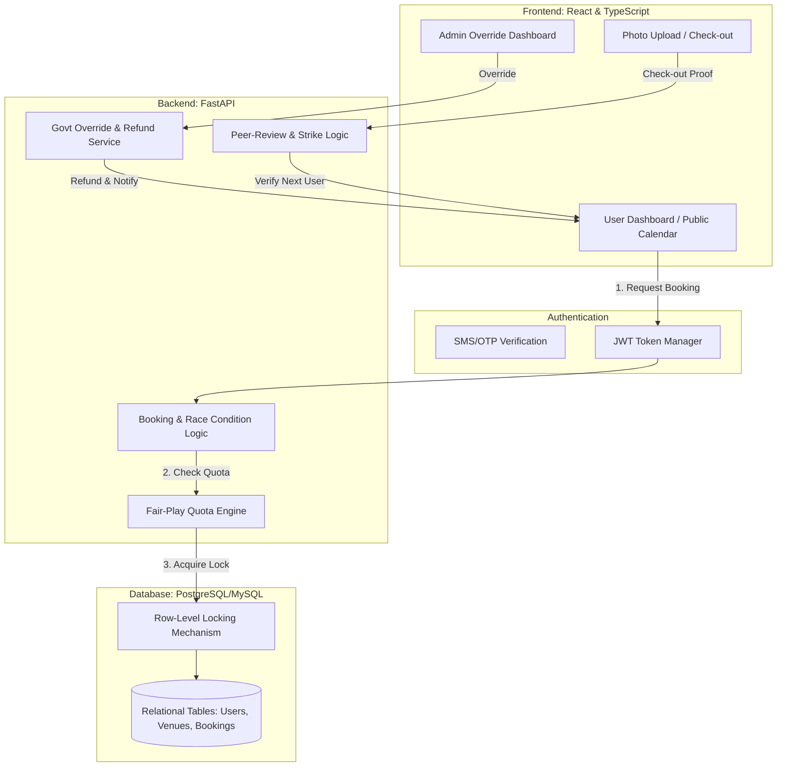

# Comprehensive Architecture & Strategic Blueprint: Transparent Public Venue & Sports Ground Scheduler

## 1. Executive Abstract

The management of public resources, specifically community halls, sports grounds, and park pavilions, has historically been plagued by inefficiency, opacity, and inequity. The "Transparent Public Venue & Sports Ground Scheduler" is a comprehensive digital solution designed to democratize access to public spaces. By transitioning from manual, easily manipulated paper ledgers to an immutable, publicly verifiable digital scheduling system, we aim to eradicate favoritism, prevent scheduling conflicts (double bookings), and provide absolute transparency to citizens.

This document outlines the architecture, technological implementation, security protocols, and societal impact of this system. The platform will utilize a modern web stack—React.js on the frontend and FastAPI on the backend—to deliver a high-performance, concurrent, and secure application. Advanced algorithms will enforce "Fair-Play" rules to prevent resource monopolization, while strict Role-Based Access Control (RBAC) and database-level concurrency management will ensure data integrity and system security.

The end result will be an intuitive, scalable, and robust platform that empowers citizens, holds administrators accountable, and maximizes the utilization of communal resources for the betterment of society.

---

## 2. Societal Impact and Value Proposition

### 2.1 Democratization of Public Goods
Public spaces are funded by taxpayer money, yet their allocation often favors those with political connections or insider knowledge. This system guarantees equal opportunity for all citizens. By making the booking ledger public, every allocation is subject to community scrutiny, fundamentally shifting the power dynamic from gatekeepers back to the public.

### 2.2 Eradication of Corruption and Favoritism
Manual booking systems are inherently vulnerable to manipulation. A digital system logs every transaction with a timestamp and user ID. The "Fair-Play" algorithm acts as an incorruptible arbiter, enforcing quotas (e.g., maximum bookings per month per user) without bias or prejudice.

### 2.3 Dispute Resolution and Social Harmony
Overlapping bookings often lead to physical altercations at the venue, wasting time and police resources. The system's race-condition prevention guarantees mathematical certainty that a time slot belongs to one party exclusively. A digital receipt acts as indisputable proof of reservation.

### 2.4 Resource Optimization
Through automated waitlists and no-show penalties, the system ensures that scarce public resources are not left idle. If a party cancels, the space is immediately reallocated, maximizing the societal utility of the venue.

---

## 3. Core Features & Functional Requirements

### 3.1 Citizen/User Features
*   **Public Transparent Ledger:** A real-time calendar view visible to all, showing which slots are booked and by which group (anonymizing sensitive PII while showing the team/event name).
*   **Self-Service Booking:** Users can browse available slots and instantly reserve them without human intervention.
*   **Automated Waitlists:** Users can queue for fully booked days; if a cancellation occurs, the system automatically allocates the slot to the next in line and notifies them via SMS/Email.
*   **Booking Management:** Cancel, reschedule (subject to availability), and view booking history.

### 3.2 Administrator/Venue Manager Features
*   **Venue Configuration:** Define venue operating hours, minimum/maximum booking durations, and closed days for maintenance.
*   **Fair-Play Rule Management:** Configure parameters such as "Max prime-time bookings per user per month" or "Penalty threshold for no-shows".
*   **Analytics and Reporting:** View utilization rates, identify most popular venues, and track user penalty statistics.

### 3.3 System/Automated Features
*   **Algorithmic Fair-Play Enforcement:** Hard-coded restrictions that automatically reject booking attempts that violate fairness policies.
*   **No-Show Penalty System:** A feedback loop where a verifiable "No-Show" increments a penalty counter. Exceeding the threshold automatically suspends the account.
*   **Concurrency Control:** Guaranteed prevention of double bookings even if thousands of users attempt to book simultaneously.
*   **VIP & Government Override Protocols:** Specialized access for official municipal use and premium revenue tiers (See Section 10).
*   **Hybrid Maintenance Accountability:** Digital check-outs and photo-proof to ensure public space cleanliness (See Section 11).

---

## 4. System Architecture & Technical Design

The system will follow a modern, decoupled client-server architecture utilizing RESTful APIs.

### 4.1 High-Level Architecture (C4 Context)

#### System Logic Flowchart (Mermaid)

*   **Client Layer:** Web browser running the React Single Page Application (SPA).
*   **API Gateway / Load Balancer:** (Optional for scale) Nginx routing traffic to backend instances.
*   **Application Server:** Uvicorn running the Python FastAPI backend.
*   **Data Persistence Layer:** MySQL or PostgreSQL (Relational Database).

### 4.2 Frontend Architecture (React.js + TypeScript)
*   **Framework:** React for component-based UI development.
*   **Language:** TypeScript for strict type checking, reducing runtime errors.
*   **State Management:** Redux Toolkit or React Query for managing server state (booking data) and caching.
*   **UI/UX:** Tailwind CSS for rapid, responsive styling. FullCalendar.js for rendering the interactive booking grid.

### 4.3 Backend Architecture (FastAPI + Python)
The backend will follow a **Layered (N-Tier) Architecture** to ensure clean separation of concerns:
1.  **Router/Controller Layer (FastAPI Routers):** Handles HTTP requests, validates input payloads using Pydantic, and returns HTTP responses.
2.  **Service/Business Logic Layer:** Contains the core intelligence (Fair-Play rules, waitlist logic, penalty calculation). It does not know about HTTP or Database specifics.
3.  **Data Access Layer (Repository):** Interacts with the database using an ORM (SQLAlchemy). Handles database queries and transactions.

### 4.4 Database Schema Design (Relational Model)
*   **`users` table:** `id`, `name`, `phone_number` (unique), `password_hash`, `role` (enum: citizen, admin), `penalty_points`, `is_suspended`.
*   **`venues` table:** `id`, `name`, `location`, `capacity`, `rules_config` (JSON).
*   **`bookings` table:** `id`, `user_id` (FK), `venue_id` (FK), `start_time`, `end_time`, `status` (enum: confirmed, cancelled, completed, no-show), `created_at`.
*   **`waitlist` table:** `id`, `user_id` (FK), `venue_id` (FK), `requested_start`, `requested_end`, `queue_position`, `created_at`.

---

## 5. Security, Identity, and Role-Based Access Control (RBAC)

### 5.1 Authentication (Identity Verification)
To prevent "bot" accounts from hoarding slots, authentication requires identity verification:
*   **OTP Verification:** Phone number verification via SMS OTP during registration. This ties a digital account to a real-world identifier, making it difficult to create hundreds of fake accounts.
*   **JWT (JSON Web Tokens):** Post-login, the backend issues a JWT. The frontend includes this token in the `Authorization` header for all protected API calls.

### 5.2 Authorization (RBAC)
The system enforces strict Role-Based Access Control at the API endpoint level:
*   **Role: GUEST (Unauthenticated):** Can only view the public calendar and venue details.
*   **Role: CITIZEN (Authenticated):** Can create bookings, join waitlists, and cancel *their own* bookings. Cannot modify venue details or bypass Fair-Play rules.
*   **Role: VENUE_MANAGER / ADMIN:** Can create/edit venues, override schedules for emergency municipal maintenance, and manage user suspensions.

### 5.3 Data Security
*   **Password Hashing:** Passwords hashed using bcrypt (never stored in plain text).
*   **Input Sanitization:** FastAPI + Pydantic automatically sanitizes and validates all incoming JSON, preventing SQL Injection and XSS attacks.

---

## 6. Concurrency and Race Condition Management

The most critical technical challenge is the "Race Condition"—two users clicking "Book" on the exact same 5:00 PM slot at the same millisecond.

### 6.1 Database Row-Level Locking
We will utilize the database's ACID properties to handle this.
*   **Implementation:** When a user attempts to book, the SQLAlchemy transaction will use a `SELECT ... FOR UPDATE` query or rely on a strict unique constraint.
*   **Unique Constraint Mechanism:** We will create a unique constraint in the `bookings` table that prevents overlapping time ranges for the same `venue_id`.
*   **Transaction Isolation:** The database serializes the requests. The first request locks the resource, completes the transaction, and commits. The second request is forced to wait, evaluates the new state (which is now booked), and safely rejects the user with a "Slot already taken" error.

---

## 7. Technology Stack Justification

*   **FastAPI (Backend):** Highly performant, natively supports asynchronous programming (ideal for handling many simultaneous booking requests), and automatically generates Swagger/OpenAPI documentation.
*   **React + TypeScript (Frontend):** Industry standard for complex web interfaces. TypeScript prevents bugs during development.
*   **MySQL / PostgreSQL (Database):** PostgreSQL is our primary production database. Relational databases are mandatory for this application because we require strict ACID transactions and relational integrity between Users, Venues, and Bookings. PostgreSQL specifically provides superior row-level locking for handling race conditions.

---

## 8. Execution Roadmap & Phases

### Phase 1: Foundation & Modeling (Weeks 1-2)
*   Finalize database schema.
*   Set up the Python/FastAPI environment and SQLAlchemy ORM.
*   Implement User Authentication (Registration, Login, JWT).

### Phase 2: Core API & Concurrency (Weeks 3-4)
*   Build CRUD APIs for Venues and Bookings.
*   Implement the core booking logic, specifically focusing on handling Race Conditions via Database constraints.
*   Develop unit tests simulating concurrent booking attempts.

### Phase 3: Algorithms & Fair-Play (Weeks 5-6)
*   Implement the Fair-Play logic (validating quotas before allowing a booking).
*   Develop the automated waitlist logic (queue progression upon cancellation).
*   Implement the No-Show penalty system tracking.

### Phase 4: Frontend Development (Weeks 7-9)
*   Set up React, TypeScript, and Tailwind.
*   Integrate FullCalendar.js.
*   Connect frontend to backend APIs for the public view and authenticated user dashboards.

### Phase 5: UAT & Deployment (Week 10)
*   User Acceptance Testing (simulating heavy load).
*   Deploy backend to a cloud provider (e.g., AWS, Render) and database to a managed SQL service.
*   Deploy frontend to Vercel or Netlify.

---

## 10. VIP & Government Override Protocols

To accommodate operational realities while maintaining transparency, the system employs a dual-layered access model:

### 10.1 Reserved Quotas (Proactive)
*   Venues can reserve a percentage of slots (e.g., 10%) exclusively for official Government use or paying VIPs.
*   **Release Mechanism:** If these slots remain unbooked **48 hours** before the event, they are automatically released to the general public.

### 10.2 Transparent Overrides (Reactive)
*   High-level officials can override an existing booking for emergency state functions.
*   **Mandatory Accountability:** The official must provide a "Reason Code" (e.g., Emergency Maintenance, Election). The public ledger will display: **"Overridden for State Event: [Reason]"**.
*   **Citizen Compensation:** Displaced citizens receive immediate automated apologies, full refunds, and priority placement on their next booking.

---

## 11. Maintenance & Hybrid Clean-up Protocol

To ensure public spaces are maintained without constant municipal oversight, the system enforces a **Peer-Review Accountability Loop**:

### 11.1 The Smart Deposit
*   For high-value or indoor venues, users pay a refundable cleaning deposit.
*   Deposits are automatically released 24 hours post-event if no cleanliness issues are reported.

### 11.2 Digital Check-Out & Photo Proof
*   Users must complete a "Digital Check-Out" by uploading a photo of the venue's condition at the end of their slot.

### 11.3 Peer-Review Penalty Loop
*   The *next* user must confirm if the venue was clean upon arrival.
*   If a mess is reported, the system flags the previous user's photo. Admin verification of a mess results in a forfeited deposit and a "Fair-Play Strike." Two strikes result in a platform ban.

---

## 12. Conclusion

The Transparent Public Venue Scheduler is more than just a software application; it is a civic infrastructure upgrade. By leveraging modern concurrent web technologies, strict relational data modeling, and algorithmic fairness, we will replace an opaque, corruption-prone manual system with a fully transparent, highly efficient digital ecosystem. The end result is a fairer society where public resources are equitably accessible to all citizens, managed without human bias, and utilized to their maximum potential.